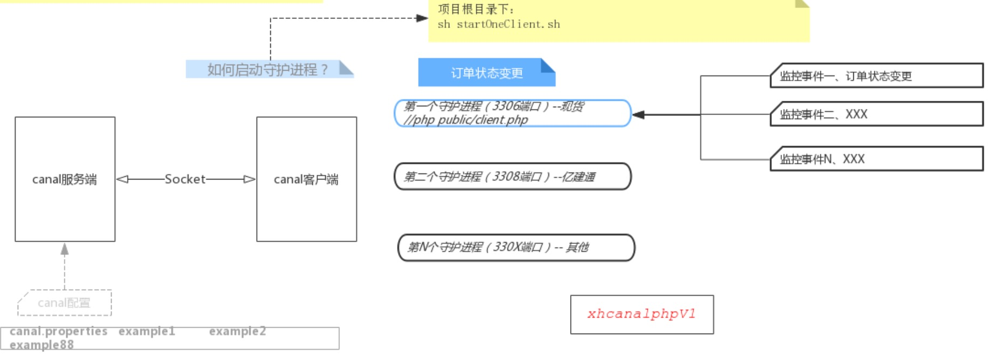

# CanalPhpForXh使用说明V1.0
###### 谭健 @date 2020-6-24

## 一、CanalPhpForXh简介

需求背景：监控订单状态变化，触发更新现货订单状态变更。（之前是每日定时任务更新脚本，现改为用canal实现。）





## 二、CanalPhpForXH目录和使用方式

###2.1 业务目录说明

``` javascript
├── config
│   ├── conf_for_entry.php
│   └── conf_for_entry_local.php
├── constDir
│   ├── BaseConst.php
│   └── OutSource.php
├── lib
│   ├── ConfigAct.php
│   ├── DataCrypto.php
│   └── SendDDNotice.php
├── monitor
│   ├── AbMonitor.php
│   ├── CurlTools.php
│   ├── DispatchChangeMonitor.php
│   ├── OrderChangeMonitor.php
│   ├── ReportNoticeMonitor.php
│   └── ReportNoticeWithContractMonitor.php
├── monitorTasks
│   ├── AbTask.php
│   ├── CaigouOrderChangeTask.php
│   ├── ContractForCarriageChangeTask.php
│   ├── ContractForPurchaseChangeTask.php
│   ├── ContractForSalesChangeTask.php
│   ├── DispatchChangeTask.php
│   ├── OrderChangeTask.php
│   └── XiaoshouOrderChangeTask.php
├── other
│   └── RetryReq.php
└── service
    ├── MsgConsumeService.php
    ├── MsgFilterMiddle.php
    ├── QueueService.php
    ├── RedisClient.php
    └── SwooleClient.php

7 directories, 27 files
```

###2.3 public目录说明
``` javascript
├── _common
│   └── _common.php
├── client_for_entry.php -- 生产脚本
└── spend.php -- 消费脚本

1 directory, 3 files
```

###2.2 项目根目录执行脚本
``` javascript
├── startService.sh
├── stopService.sh
```

## 三、canalphp实验结论
通过这段时间对canal的研究，本地做实验得出结论如下：

一、一个端口(localhost:3306)下可以通过配置（服务端或客户端配置）实现
###### 1.1 单库下1-N张表的过滤。（比如：监控 canal_test库下student开头的表）
###### 1.2 多库下不同表的过滤。（比如，监控canal_beta.student_beta、canal_test.teacher_test这两张表）
二、多个端口（(localhost:3306、localhost:3307）可以通过配置实现
###### 2.1 监控不同端口下的不同数据库
## 三、备注
3.1 如何配置?配置步骤如下（以配置3306和3307两个数据库实例为例）
###### 3.1.1 分别在conf下新建两个example，修改对应的3306和3307等数据库配置。
在/canal/conf下新建example1、example2两个目录,分别修改对应目录内的数据库配置(/conf/example1/instance.properties)

###### 3.1.2 修改canal.properties的目录配置。
canal.destinations= example
改为canal.destinations= example1,example2
###### 3.1.3 启动两个监控脚本（client.php和client3308.php）
php client.php
